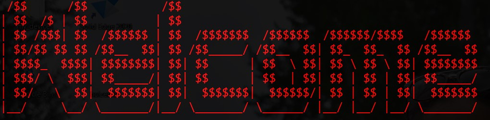
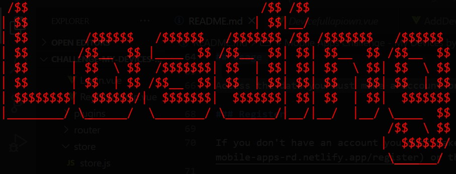
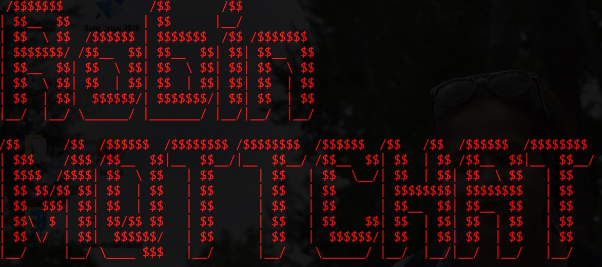
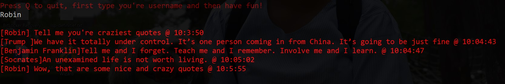
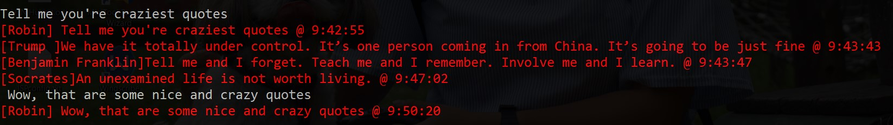
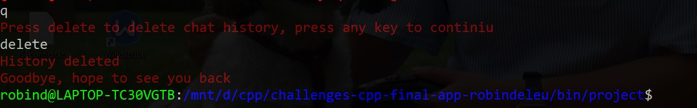

# Final Project for C++ - CLI ChatApp by Robin Deleu

[](https://lbesson.mit-license.org/)

[](http://hits.dwyl.com/robindeleu/challenges-cpp-final-app-robindeleu)

## Assignment

Build a chat application that works from the terminal. Allow people to create/join channels in which they can chat. Also allow private messages.

For communication, several options exists: TCP Sockets, MQTT, ...

- Code should be your own. You can research techniques and such but no code copy pasting. If teacher finds out (and he/she does 9 out of 10 times), the other guy/girl gets the grades and not you.
- Decent GIT history so teacher can track your progress through time. This means committing often and committing small. This is also part of proving your code is your own.
- Provide a decent README explaining your project, how it is structured, what fancy techniques you used, how someone can build your app and how to run it. Also add a couple of screenshots in your README off how your app looks.
- A makefile so the user only needs to use `make` to build your app.
- Check if your application runs on other systems (Windows vs Linux). If not, no problem, but make sure to document this inside your README.

## Setting up the project

To use this project you must use Linux. The C++ MQTT library is included in the project, if you have troubles you can look to the [MQTT guide](https://evolved-cpp.netlify.app/x-guides/mqtt/#windows-subsystem-for-linux-2) or to the [MQTT CLIENT](https://github.com/BioBoost/simple_mqtt_client)

To run this project just go to the project directory. There are 2 make commando's that are important.
To clean the bin/project directory just use this command:

```bash
make clean
```

To make the project just use this command:

```bash
make project
```

After the project is made, go to the bin/project directory. There you will find the executable.

```bash
cd bin/project
```

To run the executable use this:

```bash
./main
```

If you just want it in one line you can run this command:

```bash
make project && cd bin/project && ./main
```

## Usage

### Welcome banner

When you start the project you will see the welcome banner. It's just a simple ascii art. Normally it looks like this:



If you want to customize the banner, you can adjust it in the project directory. If you insert in the welcomemessage.txt file you're art, it will be loaded in the project.

### Loading screen

After the welcome banner, you see the loading screen. It's just a simple ascii art, that "sleeps" for a random period of time. Normally it looks like this:



If you want to customize the banner, you can adjust it in the project directory. If you insert in the loading.txt file you're art, it will be loaded in the project.

### Main chat banner

The project is almost ready to use, now you will see the project name in art. It's just a simple ascii art, normally it looks like this:



If you want to customize the banner, you can adjust it in the project directory. If you insert in the line1art.txt and line2art.txt file you're art, it will be loaded in the project.

### Chat usage

To start chatting you must enter you're name/nickname. After pressing enter you will see that a lot of text appears. This is the chat history. Everything what you saw when you're where online is saved in the output.txt file.



After the history, you are free to start chatting. Type you're message, press enter to send it. There is an example of a chat:



### Leaving the chat

When you want to leave the chat just press q and hit enter. Then you are able to delete the chat history. If you want to save the history press a random character and press enter, if you want to delete the chat history enter delete and press enter. After this the project will close.



## Authors

* **Robin Deleu** - *Student VIVES University of Applied Sciences*

## License

This project is licensed under the MIT License see the [LICENSE.md](LICENSE.md) file for details.
